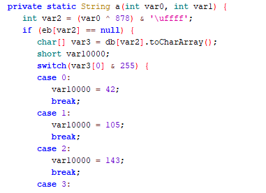
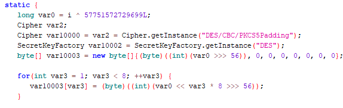
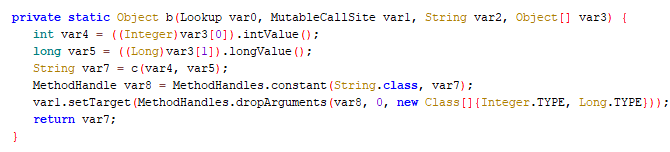
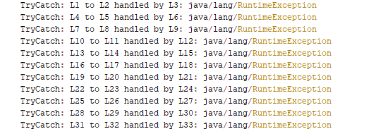

# Obfuscation Identification

| Transformer | Short Version | Identification | Sample |
| --- | --- | --- | --- |
| String Obfuscation | s11 | Class contains method with huge switch |  |
| String Obfuscation (Cipher Version) | sivm11 / ~~si11~~  | Static initializer contains ```java
Cipher.getInstance("DES/CBC/PKCS5Padding")``` |  |
| Reference Obfuscation | rvm11 | Class contains invokedynamic calls and this method |  |
| Control Flow Obfuscation | cf11 | Conditional jumps that always jump the same way | / |
| Exception Obfuscation | ex | Method contains redundant try catch blocks |  |
